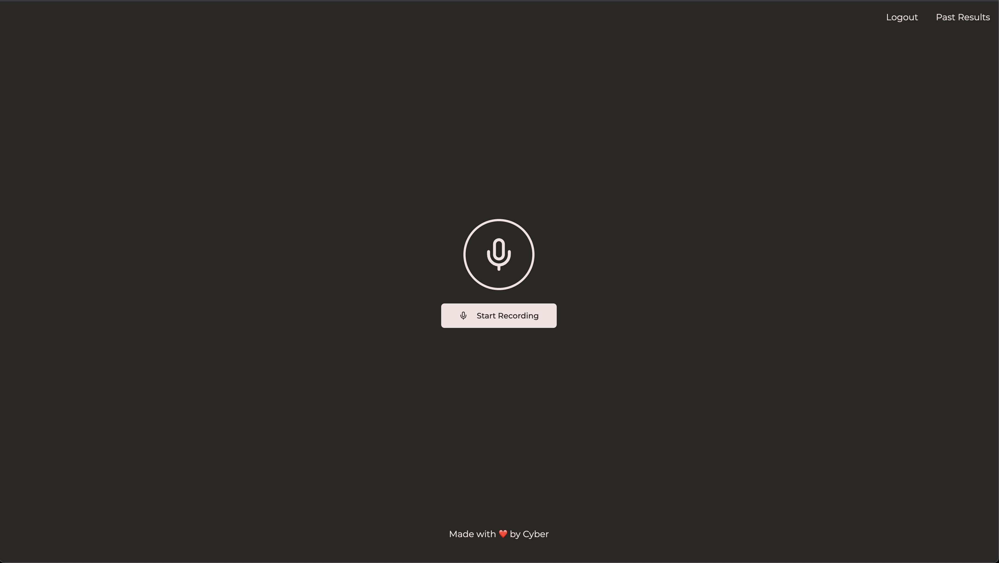

# Welcome to Accent Analyzer!

This is an extremely basic app that I built to practice my english accent with GPT-4o's latest audio model.  
It's built on a React/Next.js frontend and a Python/Django backend.  
  
Open declaration: The frontend is vibe-coded within 2 messages on v0.dev 😭  
I changed a few things around obviously and the API paths are hardcoded to localhost right now.  

The project is only 10% done - with no authorization or databases involved right now, however it's basic intended functionality works. Bells and whistles will be added by me slowly but surely.

# Backend

- Django 5+
- Django Rest Framework
- OpenAI
- Pydub for server side audio parsing

## Setup the app

The project uses a dotenv system to load important environment variables.
Make sure to have the following variables declared in your `.env` file.
```
DJANGO_SECRET='your-django-secret-key-here'  
DJANGO_DEBUG=True # or False  
OPENAI_API_KEY='your-openai-api-key-here'
```

## Steps to run the backend server

1. First of all migrate all django related data using:`python manage.py migrate`
2. Finally, run the server using `python manage.py runserver`

# Frontend

- React 19
- NextJS 15
- Tailwind CSS

## Running the app

Install all the packages using your favourite package manager and then
- `next build`
- `next dev`

## Screenshots




## Planned features
- [x] Add a database to store user data
- [x] Add a login system
- [x] Add a history page to show past recordings
- [ ] Analyze progress over time using graphs
- [ ] Ability to choose different accents
- [ ] Ability to choose your own AI model